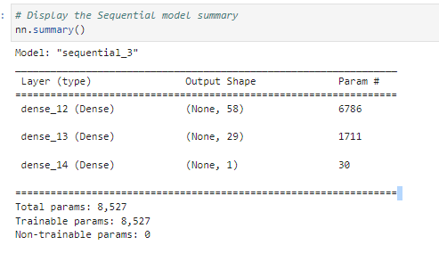

# Venture_funding_Deep_learning

The purpose of this repository is to  predict whether Alphabet Soup funding applicants will be successful, by creating a binary classification model using a deep neural network. The challenge is to train three models, and come up with best model with low loss(errors) and higher accuracy.

----

## Technologies

```python
Language: Python 3.9.12

Libraries used:

Pandas 
Jupyter Labs 
Pathlib 
Scikit-Learn 
Tensor Flow
Keras
Matplot Lib

```

-----

## Installation Guide

```python
conda install pandas
conda install jupyterlab
conda install -U Scikit-Learn
conda conda install scikit-learn
pip install --upgrade tensorflow
conda install -c conda-forge matplotlib

Check the to make sure everything has been installed properly
conda list pandas
conda list jupyter lab
conda list Scikit-learn
python -c "import tensorflow as tf;print(tf.__version__)"
python -c "import tensorflow as tf;print(tf.keras.__version__)"
```

----

## Usage

To run this analysis jupyter lab notebook has been used. To run jupyter lab you need to use GitBash and navigate to where you have exported the files associated with this project and activate your dev environment. Next, this project can be ran by navigating to the crypto_investments.ipynb jupyter notebook file.

----

## Steps Taken

1. Prepare the data for use on a neural network model.

```python
# Create a list of categorical variables 
categorical_variables = list(applicant_data_df.dtypes[applicant_data_df.dtypes == "object"].index)

# Display the categorical variables list
categorical_variable

# Create a DataFrame with the encoded variables
encoded_df = pd.DataFrame(encoded_data,
                          columns=enc.get_feature_names(categorical_variables))

# Review the DataFrame
encoded_df.head()

# creating numerical variables for model
numerical_variables_df =  applicant_data_df.drop(columns=categorical_variables)
numerical_variables_df.head()

# Add the numerical variables from the original DataFrame to the one-hot encoding DataFrame

encoded_df = pd.concat(
    [
        numerical_variables_df,
        encoded_df
    ],
    axis=1
)
```

2. Compile and evaluate a binary classification model using a neural network.

Summary of original model
]

3. Optimize the neural network model.

There are three variation to the original model:

1. Original nerual network model with two hidden layers and 50 epochs, results:
Loss: 0.55, Accuracy: 0.73

2. Alternative model 1
Three hidden layers and 75 epochs, results:
Loss: 0.70, Accuracy: 0.54

3. Alternate model 2
Two hidden layers with lesser neurons and 100 epochs, results:
Loss: 0.56, Accuracy: 0.73

4. Alternative model 3
Model created by adjusting the input data by dropping different features columns to ensure that no variables or outliers confuse the model, results:
Loss: 0.86, Accuracy: 0.69

### Conclusion

It seems original model with two hidden layers and 50 epochs performed well as compare to rest of the alternatives. Adding more hidden layers, dropping the columns or increasing the epochs couldn’t help to reduce loss or errors to 0 nor does the accuracy improved further.  

## Contributors

Brought to you by Amrita Prithiani

## License

MIT

